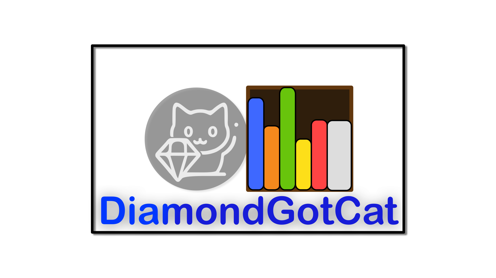

# Hello!
👋 Hi, I’m @DiamondGotCat
<br>
I like Minecraft :)
<br>
My Computer is Mac(Intel).
<br>
It's a 2013 Mac, so Minecraft and Xcode are heavy... but I'll do my best.

# Help me!
I want to create software to help players with Minecraft,
Is there anyone who would be willing to make it with me?

# Welcome Program

```
// Welcome! Program

// Swift/SwiftUI/Python
print("Welcome!")

// JavaScript
console.log("Welcome!")

// MarkDown
Welcome!

// HTML
<!DOCTYPE html>
<html>
  <head>
    <title>Welcome Page</title> 
   </head>
  <body>  
    Welcome!
  </body>
</html>
```
# Link
[My Sites](https://diamondgotcat.github.io/)
<br>
[Youtube](https://youtube.com/@DiamondGotCat)
<br>
[Blog](https://sites.google.com/view/diamondgotcat-blog)
<br>
[Azisaba Wiki](https://sites.google.com/view/diamondgotcat-azisabawiki)
<br>
[ChatGUI](https://diamondgotcat.github.io/ChatGUI/index.html)

<!---
DiamondGotCat/DiamondGotCat is a ✨ special ✨ repository because its `README.md` (this file) appears on your GitHub profile.
You can click the Preview link to take a look at your changes.
--->
